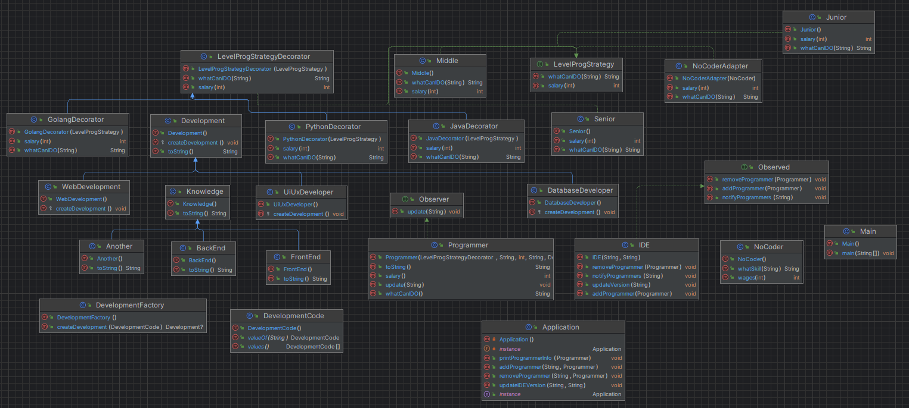
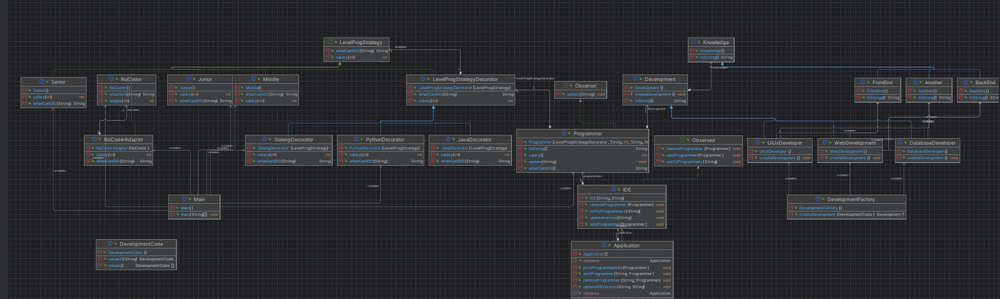

<h1>Final project - Design Patterns</h1>

  <h2 id="introduction">Introduction</h2>
  
This repository contains the code for Final project, where we explore and implement various design patterns in a Java application.

  
The goal is to show how these patterns can be used to add functionalities, create objects, and adapt classes while keeping the code flexible and easy to maintain.

  <h2 id="project-structure">Project Structure</h2>
  
The project is organized into several packages, each serving a specific purpose:

  <ul>
      <li><code>factory</code>: Contains the <code>DevelopmentFactory</code> and <code>DevelopmentCode</code> classes, implementing the Factory Method pattern for creating different types of developments.</li>
      <li><code>decorators</code>: Contains decorator classes like <code>GolangDecorator</code>, <code>PythonDecorator</code>, and <code>NoCoderAdapter</code> that apply additional functionalities to programmers.</li>
      <li><code>programmers</code>: Contains programmer classes (<code>Junior</code>, <code>Middle</code>, <code>Senior</code>, <code>NoCoder</code>, and <code>Programmer</code>) and an adapter for <code>NoCoder</code>, showing how the Adapter pattern can be used.</li>
      <li><code>Application</code>: Contains the <code>Application</code> class, which serves as the main entry point for the application.</li>
  </ul>
  <h1>Diagrams</h1>

  <h2>Diagram 1</h2>
    

  <h2>Diagram 2 with dependencies</h2>
    

  <h2 id="usage">Usage</h2>
  
To run the application, follow these steps:

  <ol>
      <li>Clone this repository to your local machine:</li>
      <code>git clone https://github.com/Bekzat158/assig1_patern.git</code>
      <li>Navigate to the project directory:</li>
      <code>cd assig1_patern</code>
      <li>Compile the Java code:</li>
      <code>javac *.java</code>
      <li>Run the main class:</li>
      <code>java Main</code>
  </ol>
  
The application will execute a set of predefined actions, and you can observe the behavior of the design patterns in action.

